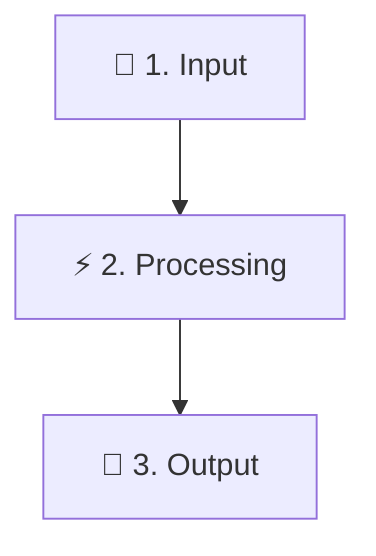

# 🎨 README & Documentation Designer

## Purpose
Empowers the agent to act as an expert technical documentation architect and visual design specialist. Transforms dry, cramped, or unformatted repository markdown files into world-class, high-status documentation that captivates readers, ensures effortless scanning, and maximizes developer adoption.

---

## 📐 Core Visual Design Principles

Every modernized README is built upon six visual engineering principles:

1. **🌬️ Generous Breathing Room (`<br/>`)**:
   - Insert purposeful `<br/>` tags before and after headers, alerts, badges, code blocks, and diagrams.
   - Prevent dense walls of text by maintaining generous vertical whitespace.

2. **✂️ Distinct Section Partitioning (`---`)**:
   - Separate distinct conceptual sections with horizontal dividers (`---`) surrounded by `<br/>` spacing.
   - Creates crisp visual stopping points that guide the reader's eye.

3. **🔤 Strong Typography & Bold Hierarchies**:
   - Bold key concepts, file paths, tool names, and primary metrics (`**like this**`).
   - Use standardized emoji headers (`# 🧩`, `## ⚡`, `### 🛠️`) for visual anchor points.

4. **📊 Rich Data Displays & Comparative Matrices**:
   - Replace long bullet lists with sleek Markdown tables.
   - Include comparison tables (e.g., *Before vs After*, *Traditional vs Modern*, *Feature Matrix*).

5. **🖼️ Visual Architecture & Mermaid Diagrams**:
   - Convert complex procedural logic or multi-step workflows into clean Mermaid flowcharts, sequence diagrams, or ASCII UI wireframe boxes.

6. **💡 GitHub-Flavored Markdown Alerts & Badges**:
   - Use `> [!NOTE]`, `> [!TIP]`, `> [!IMPORTANT]`, `> [!WARNING]`, and `> [!CAUTION]` callout blocks.
   - Standardize shields.io badges (`style=for-the-badge` or `style=flat-square`) for immediate credibility.

---

## 🛠️ Procedural Execution Workflow

```
┌──────────────────────────────────────┐
│  1. Diagnostic Audit (audit_readme)  │ ──> Scan current README for spacing, sections, links & score
└──────────────────────────────────────┘
                   │
┌──────────────────────────────────────┐
│  2. Structural Scaffolding & Layout  │ ──> Plan sections: Hero, 1-Liner, Why/What, Architecture,
└──────────────────────────────────────┘     Features, Quickstart, Tooling, Docs, Governance, License
                   │
┌──────────────────────────────────────┐
│  3. Visual Polish & Styling Inject   │ ──> Add <br/>, ---, bolding, badges, alerts, ASCII frames, Mermaid
└──────────────────────────────────────┘
                   │
┌──────────────────────────────────────┐
│  4. Verification & Link Integrity    │ ──> Run audit_readme.py --strict to verify 100/100 score
└──────────────────────────────────────┘
```

---

### Step 1: Audit Existing Documentation

Analyze the target `README.md` using the built-in diagnostic CLI:

```bash
python skills/custom/readme-designer/scripts/audit_readme.py --target README.md
```

The diagnostic script evaluates:
- **Hero & Badge Score**: Centered title, tagline, shields.io badges, and quick navigation bar.
- **Visual Spacing Density**: Presence of `<br/>` spacing tags and `---` dividers.
- **Section Completeness**: Hero, 1-Liner Quick Install, What is X / Architecture, Comparison / Core Pillars, Quickstart, Features / Catalog, Developer Tooling, Governance, License.
- **Link & Anchor Integrity**: Verifies all relative file links and internal section anchor links (`#section-id`).

---

### Step 2: Modernize & Apply Design System

Refactor the `README.md` content following this standardized structure:

#### 1. Hero Header (Centered)
```markdown
<div align="center">

# 🧩 [Project Name]

### *[Inspiring, punchy, bold tagline]*

<br/>

[](...)
[](...)

<br/>

[**⚡ Quickstart**](#-quickstart) &nbsp;•&nbsp; [**📖 Documentation**](./docs/) &nbsp;•&nbsp; [**🚀 Features**](#-features) &nbsp;•&nbsp; [**📄 License**](./LICENSE)

<br/>

</div>

---

<br/>
```

#### 2. Instant 1-Liner Install / Copy Block
```markdown
### ⚡ Instant Install (1-Liner)

Install or run directly in **one command**:

<br/>

```bash
npx your-package-name
```

<br/>

---

<br/>
```

#### 3. Why / What Problem It Solves & Architecture
```markdown
## 💡 What is [Project Name]?

[Problem description highlighting industry friction points with ❌ and solutions with ✨]

<br/>

> [!IMPORTANT]
> **Core Architectural Philosophy**  
> [Brief explanation of key breakthrough or design principle]

<br/>



<br/>

---

<br/>
```

#### 4. Feature Comparison or Core Pillars Table
```markdown
## ⚖️ Architectural Comparison / 🎯 Core Pillars

| Dimension | ❌ Traditional Approach | 🌟 [Project Name] Solution |
|---|---|---|
| **Performance** | Slow / Bloated | **Ultra-fast & lightweight** |
| **Reliability** | Untested static text | **Attested & evaluated in CI** |

<br/>

---

<br/>
```

#### 5. Quickstart with Syntax-Highlighted Examples & Expected Output
```markdown
## ⚡ Quickstart & Usage

### 1. Execute Command

<br/>

```bash
python run.py --target .
```

<br/>

```text
=================================================================
 [STATUS] Execution Complete: 100% Passed
=================================================================
```

<br/>

---

<br/>
```

#### 6. Developer Tooling / Diagnostics ASCII UI Mockup
```markdown
```
┌─────────────────────────────────────────────────────────────────────────────┐
│  🩺 DIAGNOSTIC SUITE: Health Score: 100 [GRADE A]                            │
│  [✓] Configuration Valid             [✓] Integrity Check Passed             │
└─────────────────────────────────────────────────────────────────────────────┘
```
```

#### 7. Repository Tree, Governance & License Footer
```markdown
## 📁 Repository Architecture

<br/>

```text
project-root/
├── docs/             # Documentation hub
├── scripts/          # Automation CLI tools
└── README.md         # Overview
```

<br/>

---

<br/>

## 📜 Open-Source Governance & Citations

- 🛡️ **[Security Policy](./SECURITY.md)**: Vulnerability disclosure.
- 👥 **[Collaborator Guidelines](./COLLABORATORS.md)**: Contribution rules.
- 📄 **[License](./LICENSE)**: Apache 2.0 / MIT.

<br/>

<div align="center">

**Built with ❤️ for the Developer Community**

</div>
```

---

### Step 3: Scaffold from Scratch (Optional)

If starting a brand-new repository with no existing README, use the scaffolding script:

```bash
python skills/custom/readme-designer/scripts/scaffold_readme.py \
  --name "Project Name" \
  --tagline "The Ultimate AI Toolchain" \
  --output README.md
```

---

### Step 4: Validate Readme Quality & Strict Link Checking

Run the validation suite to ensure a perfect **100/100 A+** design score and zero broken links:

```bash
python skills/custom/readme-designer/scripts/audit_readme.py --target README.md --strict
```
