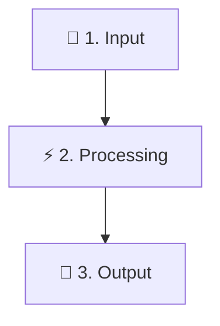

# Golden README Template Reference

```markdown
<div align="center">

# 🧩 [Project Name]

### *[Inspiring, punchy, bold tagline]*

<br/>

[](https://agentskills.io)
[](#)
[](./LICENSE)

<br/>

[**⚡ Quickstart**](#-quickstart--usage) &nbsp;•&nbsp; [**💡 Overview**](#-what-is-project) &nbsp;•&nbsp; [**⚖️ Comparison**](#️-architectural-comparison) &nbsp;•&nbsp; [**📁 Architecture**](#-repository-architecture) &nbsp;•&nbsp; [**📄 License**](./LICENSE)

<br/>

</div>

---

<br/>

### ⚡ Instant Install (1-Liner)

Install or run directly in **one command**:

<br/>

```bash
npx your-package-name
```

<br/>

---

<br/>

## 💡 What is [Project Name]?

[High-impact summary explaining the mission and solving friction points]

<br/>

- ❌ **Traditional Pain Point**: [Describe legacy difficulty or friction]
- ✨ **[Project Name] Breakthrough**: [Describe modular, modern solution]

<br/>

> [!IMPORTANT]
> **Core Architectural Philosophy**  
> [Explain progressive disclosure, performance, or determinism guarantees]

<br/>



<br/>

---

<br/>

## ⚖️ Architectural Comparison

<br/>

| Dimension | ❌ Traditional Approaches | 🌟 [Project Name] Standard |
|---|---|---|
| **Context Overhead** | Heavy (unbounded token waste) | **Ultra-lightweight (~100 tokens at boot)** |
| **Verification & Quality** | Unverified static snippets | **Automated CI quality benchmarks & diagnostics** |
| **Cross-Platform Parity** | Fragmented & drift-prone | **Synchronized across Claude, Antigravity & Cursor** |

<br/>

---

<br/>

## ⚡ Quickstart & Usage

<br/>

### 1. Run Core Pipeline

<br/>

```bash
python run.py --target .
```

<br/>

```text
=================================================================
 [STATUS] Pipeline Execution Complete: 100% Passed
=================================================================
```

<br/>

---

<br/>

## 🩺 Developer Tooling & Diagnostics

<br/>

```
┌─────────────────────────────────────────────────────────────────────────────┐
│  🩺 DIAGNOSTIC SUITE: Health Score: 100 [GRADE A+ PRODUCTION READY]         │
│  ─────────────────────────────────────────────────────────────────────────  │
│  [✓] Configuration Valid             [✓] Link Integrity 100% Resolved       │
│  [✓] Spacing & Typography Clean      [✓] Multi-Agent Directives Synchronized│
└─────────────────────────────────────────────────────────────────────────────┘
```

<br/>

---

<br/>

## 📁 Repository Architecture

<br/>

```text
project-root/
├── docs/             # Technical specifications & guides
├── scripts/          # Automation CLI tools
├── tests/            # Test harness
└── README.md         # Overview
```

<br/>

---

<br/>

## 📜 Open-Source Governance & Citations

<br/>

- 🛡️ **[Security Policy](./SECURITY.md)**: Vulnerability disclosure channels.
- 👥 **[Collaborator Guidelines](./COLLABORATORS.md)**: Maintainership policy.
- 📄 **[License](./LICENSE)**: Licensed under the **Apache 2.0 License**.

<br/>

<div align="center">

**Built with ❤️ for the Developer Community**

</div>
```
