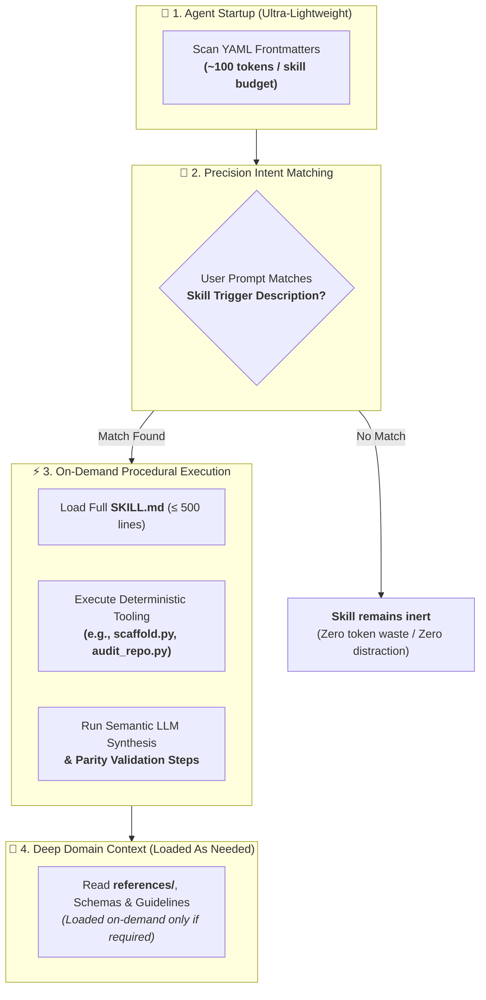
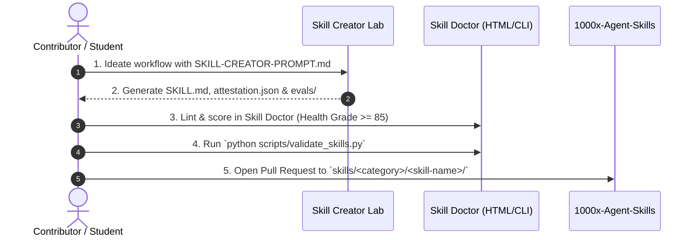

<div align="center">

# 🧩 1000x Agent Skills

### *The Capability-Declared, Attested & Evaluated Skills Suite for Autonomous AI Coding Agents*

<br/>

[](https://agentskills.io/specification)
[](#-multi-agent-ecosystem-support)
[](./utils/Skill-Doctor.html)
[](./scripts/)
[](./LICENSE)

<br/>

[**🩺 Launch Skill Doctor**](./utils/Skill-Doctor.html) &nbsp;•&nbsp; [**⚡ Quickstart & CLI**](#-quickstart--cli) &nbsp;•&nbsp; [**🧩 Skills Catalog**](#-skills-catalog) &nbsp;•&nbsp; [**📚 Docs Hub**](./docs/) &nbsp;•&nbsp; [**🎓 Student Guide**](./docs/STUDENT-GUIDE.md) &nbsp;•&nbsp; [**🧠 Creator Lab**](./utils/skill-creator/)

<br/>

</div>

---

<br/>

### ⚡ Instant Install (1-Liner)

Install any production skill directly into your project in **one command** — zero cloning required:

<br/>

```bash
# 🟣 Install to Anthropic Claude Code (.claude/skills)
npx degit kunalsuri/1000x-Agent-Skills/skills/custom/multi-agent-docs .claude/skills/multi-agent-docs

# 🔵 Install to Google Antigravity / Cursor / OpenAI Codex (.agents/skills)
npx degit kunalsuri/1000x-Agent-Skills/skills/custom/multi-agent-docs .agents/skills/multi-agent-docs
```

<br/>

---

<br/>

## 💡 What is 1000x-Agent-Skills?

Most agent prompt repositories provide static text snippets, unverified copy-paste prompts, or monolithic system instructions. In real-world software engineering, these create **severe bottlenecks**:

- ❌ **Context Exhaustion**: Massive system prompts eat into the model's effective context window before coding even begins.
- ❌ **Instruction Drift**: Different agents (Claude, Antigravity, Cursor) drift out of synchronization as rules are edited haphazardly.
- ❌ **Hallucinations & Tool Breakage**: Un-attested workflows fail silently when invoked on live CLI tools or LLM backends.
- ❌ **False Positive Triggers**: Overly broad descriptions cause agents to load heavy instructions for unrelated user tasks.

<br/>

**`1000x-Agent-Skills`** solves this with a **standardized, production-grade procedural knowledge library and developer toolchain** engineered for autonomous AI developer environments (**Claude Code**, **Google Antigravity**, **Cursor**, and **OpenAI Codex**).

<br/>

> [!IMPORTANT]
> **Core Architectural Philosophy: Progressive Disclosure**  
> Every skill operates on a 4-tier progressive discovery model. The agent loads **only ~100 tokens** at startup, expanding into full workflows and specialized references **on-demand** only when the user's intent matches the skill's declared trigger.

<br/>



<br/>

---

<br/>

## ⚖️ Architectural Comparison

| Dimension | ❌ Traditional Monolithic Prompts | 🌟 1000x-Agent-Skills Architecture |
|---|---|---|
| **Context Overhead** | Heavy (5,000 – 20,000+ tokens loaded continuously) | **Ultra-lightweight (~100 tokens at boot, full body on-demand)** |
| **Verification & Proof** | None (Untested static markdown text) | **Empirical Attestation (`attestation.json`) across Claude, Gemini & GPT** |
| **Trigger Evaluation** | Blind activation / high false triggers | **Benchmark test suite (`evals/test-cases.json`) with $\ge 90\%$ Recall** |
| **Multi-Agent Parity** | Fragmented per IDE / out-of-sync instructions | **Synchronized across Claude Code, Antigravity, Cursor & Codex** |
| **Deterministic Tooling** | Unassisted LLM hallucinations | **Integrated Python CLI engines + semantic LLM verification** |
| **Quality Control** | Manual inspection | **Interactive `Skill-Doctor.html` + Automated CI Linting** |

<br/>

---

<br/>

## 🎯 The 3 Core Pillars

Every skill in this repository is governed by three non-negotiable engineering guarantees:

<br/>

```
┌─────────────────────────────────┐      ┌─────────────────────────────────┐      ┌─────────────────────────────────┐
│          1. DECLARED            │      │          2. ATTESTED            │      │          3. EVALUATED           │
│   Strict YAML Frontmatter       │ ───> │   Empirical Proof & Logs        │ ───> │   Intent Precision & Recall     │
│   Schema, Tools & Token Budgets │      │   Multi-Model Resilience Matrix │      │   Automated Test-Case Suite     │
└─────────────────────────────────┘      └─────────────────────────────────┘      └─────────────────────────────────┘
```

<br/>

| Pillar | File / Artifact | Guarantee & Technical Specification |
|---|---|---|
| **1. 📋 Declared** | [`SKILL.md`](./skills/custom/multi-agent-docs/SKILL.md) | **Strict YAML frontmatter interface** (`name`, `version`, `description`, `allowed-tools`, `compatibility`, `tags`). Concise body limit ($\le 500$ lines) containing actionable procedural instructions. |
| **2. 🛡️ Attested** | [`attestation.json`](./docs/ATTESTATION-SPEC.md) | **Empirical proof of execution** on production LLM backends (**Claude 3.7 Sonnet**, **Gemini 3.7 Flash**, **GPT-4o**), documenting success rates, token usage, tool call sequences, and recovery resilience. |
| **3. 🧪 Evaluated** | [`evals/test-cases.json`](./docs/EVALUATION-FRAMEWORK.md) | **Positive and negative benchmark suites** measuring intent classification precision ($\ge 85\%$) and recall ($\ge 90\%$) to prevent false triggers and token wastage. |

<br/>

---

<br/>

## 🤖 Multi-Agent Ecosystem Support

A single unified skill library engineered to seamlessly empower all autonomous AI developer platforms:

<br/>

| Agent Platform | Directives / Config | Native Integration Path | Target Directory |
|---|---|---|---|
| **🟣 Anthropic Claude Code** | `CLAUDE.md` + `.claude/` | Native `skills/` declaration & CLI execution | `~/.claude/skills/` or `.claude/skills/` |
| **🔵 Google Antigravity** | `AGENTS.md` + `.agents/` | Global plugin root & local workspace skills | `~/.gemini/config/skills/` or `.agents/skills/` |
| **🟢 Cursor Agent** | `.cursorrules` + `.cursor/` | Rule injection & progressive context prompts | `.cursor/rules/` or workspace rules |
| **🔴 OpenAI Codex / Canvas** | `AGENTS.md` root prompt | Capability injection & workflow scripts | Active workspace root |

<br/>

---

<br/>

## 🧩 Skills Catalog

Skills are curated into **Custom** (cross-platform, multi-agent workflows), **Anthropic** (Claude-focused workflows), and **Google** (Antigravity & Gemini workflows).

<br/>

### 🟢 Production-Ready & Attested Skills

<br/>

| Skill & Link | Version | Status | Highlights & Capabilities | Trigger Context |
|---|:---:|:---:|---|---|
| [**`multi-agent-docs`**](./skills/custom/multi-agent-docs/SKILL.md) | `v1.1.0` | `🟢 Verified` | • Deterministic project scaffolding (`scaffold.py`)<br/>• Automated multi-agent parity validation (`validate_sync.py`)<br/>• Synchronizes `CLAUDE.md`, `AGENTS.md`, `.claude/`, `.agents/` | **Use when** configuring a repository for multi-agent workflows (Claude Code, Antigravity, Cursor, Codex) or when resolving instruction drift. |
| [**`preflight-test-engineer`**](./skills/custom/preflight-test-engineer/SKILL.md) | `v1.0.0` | `🟢 Verified` | • Codebase AST & stack analyzer (`analyze_codebase.py`)<br/>• Deterministic `/tests/` test suite generator (`scaffold_tests.py`)<br/>• 4-stage pre-flight runner (`run_preflight.py`) | **Use when** asked to test a codebase before running, scaffold a test suite into `/tests/`, verify test coverage, or execute pre-flight sanity checks. |
| [**`public-repo-release-review`**](./skills/custom/public-repo-release-review/SKILL.md) | `v1.0.0` | `🟢 Verified` | • Pre-flight public release audit engine (`audit_repo.py`)<br/>• Deep secret leak scanner & governance verification<br/>• Scaffolding for `SECURITY.md`, `COLLABORATORS.md`, `CITATION.cff` | **Use when** reviewing a codebase before public release, auditing repository security and governance, or preparing for public launch. |
| [**`readme-designer`**](./skills/custom/readme-designer/SKILL.md) | `v1.0.0` | `🟢 Verified` | • Markdown visual design, spacing (`<br/>`) & structure<br/>• Automated diagnostic quality auditor (`audit_readme.py`)<br/>• Scaffolding engine for modern READMEs (`scaffold_readme.py`) | **Use when** creating, redesigning, formatting, modernizing, improving readability of, or polishing a project README, documentation, or landing page. |

<br/>

> [!TIP]
> **Explore Category Indexes**:
> - 📂 [**Custom Skills Index (`skills/custom/`)**](./skills/custom/README.md)
> - 📂 [**Anthropic Skills Index (`skills/anthropic/`)**](./skills/anthropic/README.md)
> - 📂 [**Google Skills Index (`skills/google/`)**](./skills/google/README.md)

<br/>

---

<br/>

## 🩺 Built-In Developer Tooling & Diagnostics

<br/>

### 1. 🩺 Skill Doctor & Health Suite (`Skill-Doctor.html`)

An interactive, zero-dependency offline web application built with vanilla web technologies to **lint, benchmark, score, format, and generate compliant skills**.

<br/>

- **📝 Live SKILL.md Inspector & Linter**: Real-time YAML parser, regex validation, header token estimator ($\le 150$), line tracker ($\le 500$), and 1-click **Auto-Fix** & **Copy**.
- **✨ Interactive Skill Builder**: Visual form builder to author compliant `SKILL.md` packages with structured steps and instant downloads.
- **📐 Open Specification & Format Guide**: Interactive reference covering specification rules, attestation schemas, and evaluation metrics.
- **🚀 Zero Setup Required**: Open [`utils/Skill-Doctor.html`](./utils/Skill-Doctor.html) in any modern browser!

<br/>

```
┌─────────────────────────────────────────────────────────────────────────────┐
│  🩺 SKILL DOCTOR: Health Score: 100 [GRADE A - PRODUCTION READY]            │
│  ─────────────────────────────────────────────────────────────────────────  │
│  [✓] YAML Frontmatter Valid          [✓] Header Token Budget: ~85 (<=150)   │
│  [✓] Trigger Context Explicit        [✓] Body Line Budget: 58 (<=500)       │
│  [✓] Attestation Schema Verified     [✓] Intent Benchmark Evals Present     │
└─────────────────────────────────────────────────────────────────────────────┘
```

<br/>

### 2. 🧠 Skill Creator Lab (`/utils/skill-creator/`)

A guided co-design prompt framework for authoring compliant agent skills alongside Claude or Antigravity:

- 📄 [`SKILL-CREATOR-PROMPT.md`](./utils/skill-creator/SKILL-CREATOR-PROMPT.md): Step-by-step LLM co-design prompt.
- 📄 [`SKILL-TEMPLATE.md`](./utils/skill-creator/SKILL-TEMPLATE.md): Clean boilerplate template.
- 📄 [`attestation-template.json`](./utils/skill-creator/attestation-template.json): Attestation boilerplate schema.
- 📄 [`evals-template.json`](./utils/skill-creator/evals-template.json): Intent evaluation test-case boilerplate.

<br/>

---

<br/>

## ⚡ Quickstart & CLI

<br/>

### 1. 1-Liner Skill Installation via `npx`

Install any skill directly into your project without cloning this repository:

<br/>

```bash
# 🟣 Install multi-agent-docs to Claude Code
npx degit kunalsuri/1000x-Agent-Skills/skills/custom/multi-agent-docs .claude/skills/multi-agent-docs

# 🔵 Install public-repo-release-review to Antigravity / Cursor
npx degit kunalsuri/1000x-Agent-Skills/skills/custom/public-repo-release-review .agents/skills/public-repo-release-review
```

<br/>

### 2. Local Python Installer CLI (`scripts/install_to_agent.py`)

If you have cloned the repository locally, use the cross-platform Python installer CLI:

<br/>

```bash
# 🚀 Install all skills to Google Antigravity global config (~/.gemini/config/skills)
python scripts/install_to_agent.py --target antigravity --all

# 🚀 Install all skills to Claude Code global config (~/.claude/skills)
python scripts/install_to_agent.py --target claude --all

# 🚀 Install a specific skill to Cursor (.cursor/rules)
python scripts/install_to_agent.py --target cursor --skill multi-agent-docs
```

<br/>

### 3. Run the Automated CI Validation Suite (`scripts/validate_skills.py`)

Verify YAML frontmatter, line limits, attestation schemas, and evaluation datasets across all repository skills:

<br/>

```bash
python scripts/validate_skills.py
```

<br/>

```text
=================================================================
 [SKILL DOCTOR] 1000x-Agent-Skills Validation Suite
=================================================================
[PASS] [custom/multi-agent-docs] -> PASS
[PASS] [custom/public-repo-release-review] -> PASS

 [README AUDIT] ✅ README.md skills catalog matches physical filesystem 1:1.

=================================================================
 Summary: 2 skills scanned | 2 Passed | 0 Warnings | 0 Failed
=================================================================
```

<br/>

### 4. Execute Flagship Skill Engines Directly

<br/>

```bash
# 🛠️ Scaffold multi-agent documentation (.claude/, .agents/, CLAUDE.md, AGENTS.md)
python skills/custom/multi-agent-docs/scripts/scaffold.py --target .

# 🔄 Validate that CLAUDE.md and AGENTS.md are in exact parity
python skills/custom/multi-agent-docs/scripts/validate_sync.py --target .

# 🔒 Run pre-flight release audit for public GitHub readiness
python skills/custom/public-repo-release-review/scripts/audit_repo.py --target . --strict

# 📝 Scaffold missing open-source governance files (SECURITY.md, COLLABORATORS.md, CITATION.cff)
python skills/custom/public-repo-release-review/scripts/scaffold_governance.py --target . --collaborators-mode solo

# 🎨 Audit Markdown / README visual hierarchy, spacing, badges & link integrity
python skills/custom/readme-designer/scripts/audit_readme.py --target README.md --strict

# ✨ Scaffold an ultra-modern README boilerplate from scratch
python skills/custom/readme-designer/scripts/scaffold_readme.py --name "My Project" --tagline "Awesome AI Project"
```

<br/>

---

<br/>

## 📁 Repository Architecture

<br/>

```text
1000x-Agent-Skills/
├── .agents/                      # Antigravity agent configuration & workspace rules
│   ├── rules/                    # Local rule definitions
│   ├── skills/                   # Local workspace skills
│   │   ├── multi-agent-docs/     # Workspace copy of multi-agent-docs
│   │   ├── public-repo-release-review/ # Workspace copy of public-repo-release-review
│   │   └── readme-designer/      # Workspace copy of readme-designer
│   └── AGENTS.md                 # Agent operating directives
├── .claude/                      # Claude Code agent configuration
├── .github/                      # GitHub issue forms, PR template & CI workflows
│   ├── ISSUE_TEMPLATE/           # bug_report.yml, feature_request.yml
│   ├── workflows/                # ci.yml (Skill validation & pre-flight audit)
│   └── PULL_REQUEST_TEMPLATE.md  # Standard pull request checklist
├── docs/                         # Specification & Engineering Documentation Hub
│   ├── SPECIFICATIONS.md         # Open Agent Skills format and schema guidelines
│   ├── ATTESTATION-SPEC.md       # Attestation JSON specification & verification levels
│   ├── EVALUATION-FRAMEWORK.md   # Precision / recall benchmark dataset design
│   ├── ECOSYSTEM-TRACKER.md      # Living directory of agent specs, papers & tooling
│   ├── STUDENT-GUIDE.md          # Step-by-step student authoring & assignment guide
│   └── AGENTS.md                 # Multi-agent operating rules & directives
├── scripts/                      # CLI Maintenance & Deployment Tools
│   ├── validate_skills.py        # Automated CI/CD skill validation engine
│   └── install_to_agent.py       # Cross-platform installer for Claude, Antigravity & Cursor
├── skills/                       # Production Skills Catalog
│   ├── custom/                   # Cross-agent & workflow skills
│   │   ├── multi-agent-docs/     # Flagship synchronized multi-agent documentation skill
│   │   ├── public-repo-release-review/ # Flagship pre-flight public release review & audit
│   │   ├── readme-designer/      # Flagship README & documentation visual design skill
│   │   └── README.md             # Custom skills index & requirements
│   ├── anthropic/                # Claude-focused engineering workflows
│   │   └── README.md
│   └── google/                   # Antigravity & Gemini-focused workflows
│       └── README.md
├── utils/                        # Developer Lab & Diagnostics
│   ├── Skill-Doctor.html         # Interactive offline web-app linter & health dashboard
│   └── skill-creator/            # Co-design prompt, starters & schema templates
├── AGENTS.md                     # Root multi-agent directives (Antigravity/Cursor/Codex)
├── CLAUDE.md                     # Root Claude Code configuration & guidelines
├── CITATION.cff                  # Machine-readable software citation metadata (CFF)
├── CITATIONS.md                  # Human-readable citation formats (BibTeX, APA, IEEE)
├── CODE_OF_CONDUCT.md            # Contributor Covenant v2.1 Code of Conduct
├── COLLABORATORS.md              # Solo-maintainer & contribution policy
├── LICENSE                       # Apache 2.0 Open Source License
├── README.md                     # Repository overview & quickstart
├── SECURITY.md                   # Security vulnerability disclosure & triage policy
└── SUPPORT.md                    # Support channels & discussion guidelines
```

<br/>

---

<br/>

## 🛠️ How to Author & Submit a Skill

<br/>



<br/>

1. **💡 Ideate**: Identify a recurring, high-value developer workflow or domain-specific expertise.
2. **✍️ Draft with LLM**: Use [`utils/skill-creator/SKILL-CREATOR-PROMPT.md`](./utils/skill-creator/SKILL-CREATOR-PROMPT.md) with Claude 3.7 or Antigravity.
3. **🩺 Lint in Skill Doctor**: Open [`utils/Skill-Doctor.html`](./utils/Skill-Doctor.html) and achieve a **Grade A Health Score ($\ge 85$)**.
4. **🛡️ Attest & Evaluate**:
   - Provide realistic trigger prompts in `evals/test-cases.json`.
   - Record tested model backends and resilience metrics in `attestation.json`.
5. **🚀 Verify & Submit**:
   - Run `python scripts/validate_skills.py` locally.
   - Submit a clean Pull Request into `skills/<category>/<your-skill-name>/`.

<br/>

---

<br/>

## 📚 Ecosystem & Specifications Hub

<br/>

| Document | Description | Key Focus Area |
|---|---|---|
| 📖 [**Agent Skills Specification (`docs/SPECIFICATIONS.md`)**](./docs/SPECIFICATIONS.md) | Official Open Agent Skills specification | Frontmatter syntax, parameters, token budgets |
| 🛡️ [**Attestation Specification (`docs/ATTESTATION-SPEC.md`)**](./docs/ATTESTATION-SPEC.md) | Multi-model proof schemas & audit levels | LLM execution logs, resilience matrix |
| 📊 [**Evaluation Framework (`docs/EVALUATION-FRAMEWORK.md`)**](./docs/EVALUATION-FRAMEWORK.md) | Trigger precision & recall benchmarking | Test-case design, synthetic datasets |
| 🌐 [**Ecosystem Tracker (`docs/ECOSYSTEM-TRACKER.md`)**](./docs/ECOSYSTEM-TRACKER.md) | Living directory of agent protocols & papers | MCP, tool standards, research papers |
| 🎓 [**Student & Contributor Guide (`docs/STUDENT-GUIDE.md`)**](./docs/STUDENT-GUIDE.md) | Practical step-by-step authoring walkthrough | Coursework submission checklist & rubric |

<br/>

---

<br/>

## 📜 Open-Source Governance, Security & Citations

<br/>

- 🛡️ **[Security Policy (`SECURITY.md`)](./SECURITY.md)**: Vulnerability disclosure channels, threat triage guidelines, and responsible disclosure timeline.
- 👥 **[Collaborator Guidelines (`COLLABORATORS.md`)](./COLLABORATORS.md)**: Project maintainership status, issue protocol, and contribution policy.
- 📑 **[Citation Metadata (`CITATION.cff`)](./CITATION.cff)** & **[Citations Guide (`CITATIONS.md`)](./CITATIONS.md)**: Academic and software citations (BibTeX, APA, IEEE).
- 🤝 **[Code of Conduct (`CODE_OF_CONDUCT.md`)](./CODE_OF_CONDUCT.md)**: Contributor Covenant v2.1 standards.
- 💬 **[Support Channels (`SUPPORT.md`)](./SUPPORT.md)**: Help resources, discussions, and issue guidelines.

<br/>

```bibtex
@software{suri2025_1000x_agent_skills,
  author       = {Kunal Suri},
  title        = {1000x-Agent-Skills: The Capability-Declared, Attested & Evaluated Skills Suite for Autonomous AI Coding Agents},
  year         = {2025},
  publisher    = {GitHub},
  url          = {https://github.com/kunalsuri/1000x-Agent-Skills}
}
```

<br/>

---

<br/>

## 📄 License

This project is licensed under the **Apache 2.0 License** — see the [LICENSE](./LICENSE) file for complete details.

<br/>

<div align="center">

**Built with ❤️ for the Autonomous AI Developer Community**

[⭐ Star on GitHub](https://github.com/kunalsuri/1000x-Agent-Skills) • [🐛 Report an Issue](https://github.com/kunalsuri/1000x-Agent-Skills/issues) • [🤝 Submit a Skill](https://github.com/kunalsuri/1000x-Agent-Skills/pulls)

</div>
