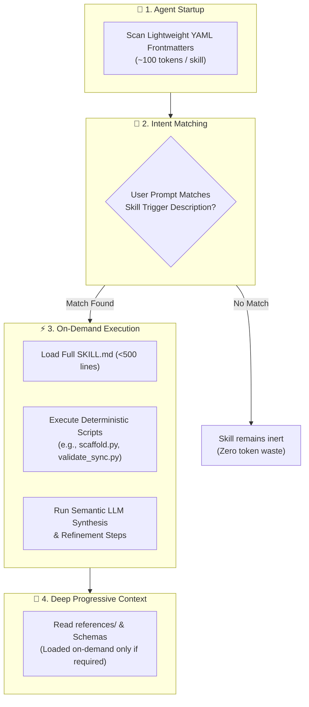
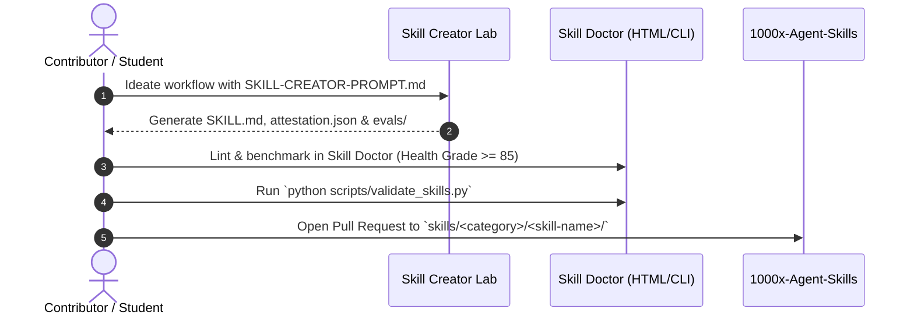

<div align="center">

# 🧩 1000x Agent Skills

### *The Capability-Declared, Attested & Evaluated Skills Suite for Autonomous AI Coding Agents*

[](https://agentskills.io/specification)
[](#-multi-agent-ecosystem-support)
[](./utils/Skill-Doctor.html)
[](./scripts/)
[](./LICENSE)

<br/>

[**🩺 Launch Skill Doctor**](./utils/Skill-Doctor.html) • [**⚡ Quickstart & CLI**](#-quickstart--cli) • [**🧩 Skills Catalog**](#-skills-catalog) • [**📚 Documentation Hub**](./docs/) • [**🎓 Student Guide**](./docs/STUDENT-GUIDE.md) • [**🧠 Creator Lab**](./utils/skill-creator/)

</div>

---

## 💡 What is 1000x-Agent-Skills?

Most agent prompt repositories provide static prompt text, unverified copy-paste snippets, or monolithic system instructions. In production, these lead to **context exhaustion**, **hallucinations**, **instruction drift**, and **silent failure**.

**`1000x-Agent-Skills`** is a standardized, production-grade procedural knowledge library and developer toolchain engineered for autonomous AI developer environments (**Claude Code**, **Google Antigravity**, **Cursor**, and **OpenAI Codex**).

Built on the open **[Agent Skills Specification](https://agentskills.io/specification)** and **Progressive Disclosure Architecture**, each skill gives coding agents deterministic capabilities, structured workflows, and deep domain context *only when needed*—without overloading the agent's context window.



---

## 🎯 The 3 Core Pillars

Every skill in this repository is governed by three rigorous engineering guarantees:

```
┌────────────────────────────────┐     ┌────────────────────────────────┐     ┌────────────────────────────────┐
│         1. DECLARED            │     │         2. ATTESTED            │     │         3. EVALUATED           │
│  Strict YAML Frontmatter       │ ──> │  Empirical Proof & Logs        │ ──> │  Intent Precision & Recall     │
│  Schema, Tool Bindings, Limits │     │  Multi-Model Resilience Matrix │     │  Automated Test-Case Suite     │
└────────────────────────────────┘     └────────────────────────────────┘     └────────────────────────────────┘
```

| Pillar | File / Artifact | Guarantee & Technical Requirement |
|---|---|---|
| **1. Declared** | [`SKILL.md`](./skills/custom/multi-agent-docs/SKILL.md) | Strict YAML frontmatter interface (`name`, `version`, `description`, `allowed-tools`, `compatibility`, `tags`). Concise body ($\le 500$ lines) containing actionable procedural instructions. |
| **2. Attested** | [`attestation.json`](./docs/ATTESTATION-SPEC.md) | Empirical proof of execution on production LLM backends (**Claude 3.7 Sonnet**, **Gemini 3.7 Flash**, **GPT-4o**), documenting success rates, token usage, and recovery resilience. |
| **3. Evaluated** | [`evals/test-cases.json`](./docs/EVALUATION-FRAMEWORK.md) | Positive and negative prompt test suites measuring intent classification precision ($\ge 85\%$) and recall ($\ge 90\%$) to prevent false triggers and token wastage. |

---

## 🤖 Multi-Agent Ecosystem Support

One skill repository to power all of your autonomous AI developer tooling:

| Agent Platform | Directives / Configuration | Integration Path | Target Directory |
|---|---|---|---|
| 🟣 **Anthropic Claude Code** | `CLAUDE.md` + `.claude/` | Native `skills/` & tool invocation | `~/.claude/skills/` |
| 🔵 **Google Antigravity** | `AGENTS.md` + `.agents/` | Global & workspace skill packages | `~/.gemini/config/skills/` or `.agents/skills/` |
| 🟢 **Cursor Agent** | `.cursorrules` + `.cursor/` | Rule injection & progressive prompts | `.cursor/rules/` |
| 🔴 **OpenAI Codex / Canvas** | `AGENTS.md` system prompt | Capability prompts & workflow scripts | Active workspace root |

---

## 🧩 Skills Catalog

Skills are organized into `custom/` (multi-agent, cross-platform workflows), `anthropic/` (Claude-native workflows), and `google/` (Antigravity & Gemini workflows).

### 🟢 Verified & Production-Ready Skills

| Category | Skill | Version | Attestation | Description & Trigger Context |
|---|---|---|---|---|
| **Custom** | [`multi-agent-docs`](./skills/custom/multi-agent-docs/SKILL.md) | `v1.1.0` | `🟢 Verified` | Deterministically scaffolds & synchronizes `CLAUDE.md`, `AGENTS.md`, `.claude/`, and `.agents/` across platforms using automated manifest inspection scripts (`scaffold.py`) followed by semantic refinement and drift validation (`validate_sync.py`). |
| **Custom** | [`public-repo-release-review`](./skills/custom/public-repo-release-review/SKILL.md) | `v1.0.0` | `🟢 Verified` | Pre-flight audit suite for public GitHub releases: deep secret leak scanning, open-source governance verification (`SECURITY.md`, `COLLABORATORS.md`, `CITATION.cff`, `CODE_OF_CONDUCT.md`), link integrity validation, and automated compliance scorecard (`audit_repo.py`). |

---

### 💡 Contributing New Skills

Looking to add a skill? We welcome community and student contributions for Anthropic, Google, and Custom agent workflows.

1. Review the [**Student & Contributor Guide**](./docs/STUDENT-GUIDE.md).
2. Use the [**Skill Creator Prompt**](./utils/skill-creator/SKILL-CREATOR-PROMPT.md) and [**Skill Doctor**](./utils/Skill-Doctor.html) to author and validate your package.
3. Open a Pull Request adding your skill under `skills/<category>/<skill-name>/`.


---

## 🩺 Built-In Developer Tooling

### 1. 🩺 Skill Doctor & Creator (`Skill-Doctor.html`)
An interactive, zero-dependency offline web application built with vanilla web technologies to lint, score, format, and generate skill packages.

- **📝 SKILL.md Inspector & Doctor**: Real-time YAML parser, regex validator, token estimator (budget $\le 150$), line tracker (budget $\le 500$), trigger strength analyzer, and 1-click **Auto-Fix** & **Copy**.
- **✨ Interactive Skill Builder**: Visual form builder to generate compliant `SKILL.md` files with frontmatter, allowed tools, structured steps, and instant downloads.
- **📐 Open Specification & Format Guide**: Built-in reference for specification rules, attestation schemas, and evaluation metrics.
- **Usage**: Double click or open [`utils/Skill-Doctor.html`](./utils/Skill-Doctor.html) in any web browser with zero setup!

```
┌─────────────────────────────────────────────────────────────────────────────┐
│  🩺 SKILL DOCTOR: Health Score: 100 [GRADE A]                               │
│  [✓] YAML Frontmatter Valid   [✓] Header Tokens: ~85 (<=150)                │
│  [✓] Trigger Context Defined  [✓] Body Lines: 58 (<=500)                    │
│  [✓] Attestation Schema Valid [✓] Intent Evals Present                      │
└─────────────────────────────────────────────────────────────────────────────┘
```

### 2. 🧠 Skill Creator Lab (`/utils/skill-creator/`)
A guided co-design prompt framework for authoring compliant agent skills alongside Claude or Antigravity:
- [`SKILL-CREATOR-PROMPT.md`](./utils/skill-creator/SKILL-CREATOR-PROMPT.md): Step-by-step LLM co-design prompt.
- [`SKILL-TEMPLATE.md`](./utils/skill-creator/SKILL-TEMPLATE.md): Clean boilerplate template.
- [`attestation-template.json`](./utils/skill-creator/attestation-template.json): Attestation boilerplate schema.
- [`evals-template.json`](./utils/skill-creator/evals-template.json): Intent evaluation test-case boilerplate.

---

## ⚡ Quickstart & CLI

### 1. Validate All Repository Skills
Run the built-in validation suite to verify YAML frontmatter, body limits, attestation files, and test coverage:

```bash
python scripts/validate_skills.py
```

```text
=================================================================
 [SKILL DOCTOR] 1000x-Agent-Skills Validation Suite
=================================================================
[PASS] [custom/multi-agent-docs] -> PASS

=================================================================
 Summary: 1 skills scanned | 1 Passed | 0 Warnings | 0 Failed
=================================================================
```

### 2. Install Skills into Your Agent Environment

Use `scripts/install_to_agent.py` to seamlessly copy skills to your preferred AI agent:

```bash
# 🚀 Install all skills to Google Antigravity (~/.gemini/config/skills)
python scripts/install_to_agent.py --target antigravity --all

# 🚀 Install all skills to Claude Code (~/.claude/skills)
python scripts/install_to_agent.py --target claude --all

# 🚀 Install a specific skill to Cursor (.cursor/rules)
python scripts/install_to_agent.py --target cursor --skill multi-agent-docs
```

### 3. Run Flagship Skill Tools Directly

```bash
# Scaffold multi-agent documentation (.claude/, .agents/, CLAUDE.md, AGENTS.md)
python skills/custom/multi-agent-docs/scripts/scaffold.py --target .

# Validate that CLAUDE.md and AGENTS.md are in exact parity
python skills/custom/multi-agent-docs/scripts/validate_sync.py --target .

# Run pre-flight release audit for public GitHub readiness (secrets, governance, link integrity)
python skills/custom/public-repo-release-review/scripts/audit_repo.py --target . --strict

# Scaffold missing open-source governance files (SECURITY.md, COLLABORATORS.md, CITATION.cff, etc.)
python skills/custom/public-repo-release-review/scripts/scaffold_governance.py --target . --collaborators-mode solo
```

---

## 📁 Repository Architecture

```text
1000x-Agent-Skills/
├── .agents/                      # Antigravity agent configuration & local rules
│   ├── rules/                    # Local rule definitions
│   ├── skills/                   # Local workspace skills
│   │   ├── multi-agent-docs/     # Workspace copy of multi-agent-docs
│   │   └── public-repo-release-review/ # Workspace copy of public-repo-release-review
│   └── AGENTS.md                 # Agent operating directives
├── .claude/                      # Claude Code agent configuration
├── .github/                      # GitHub issue forms, PR template & CI workflows
│   ├── ISSUE_TEMPLATE/           # bug_report.yml, feature_request.yml
│   ├── workflows/                # ci.yml (Skill validation & pre-flight audit)
│   └── PULL_REQUEST_TEMPLATE.md  # Standard pull request checklist
├── docs/                         # Specification & Engineering Documentation
│   ├── SPECIFICATIONS.md         # Open Agent Skills format and schema guidelines
│   ├── ATTESTATION-SPEC.md       # Attestation JSON specification & verification levels
│   ├── EVALUATION-FRAMEWORK.md   # Precision / recall benchmark dataset design
│   ├── ECOSYSTEM-TRACKER.md      # Living directory of agent specs, papers & tooling
│   ├── STUDENT-GUIDE.md          # Step-by-step student authoring & assignment guide
│   └── AGENTS.md                 # Multi-agent operating rules & directives
├── scripts/                      # CLI Maintenance & Deployment Tools
│   ├── validate_skills.py        # Automated CI/CD skill validation engine
│   └── install_to_agent.py       # Cross-platform installer for Claude, Antigravity & Cursor
├── skills/                       # Production Skills Catalog
│   ├── custom/                   # Cross-agent & workflow skills
│   │   ├── multi-agent-docs/     # Flagship synchronized multi-agent documentation skill
│   │   ├── public-repo-release-review/ # Flagship pre-flight public release review & audit
│   │   └── README.md             # Custom skills index & requirements
│   ├── anthropic/                # Claude-focused engineering workflows
│   │   └── README.md
│   └── google/                   # Antigravity & Gemini-focused workflows
│       └── README.md
├── utils/                        # Developer Lab & Diagnostics
│   ├── Skill-Doctor.html         # Interactive offline web-app linter & health dashboard
│   └── skill-creator/            # Co-design prompt, starters & schema templates
├── AGENTS.md                     # Root multi-agent directives (Antigravity/Cursor/Codex)
├── CLAUDE.md                     # Root Claude Code configuration & guidelines
├── CITATION.cff                  # Machine-readable software citation metadata (CFF)
├── CITATIONS.md                  # Human-readable citation formats (BibTeX, APA, IEEE)
├── CODE_OF_CONDUCT.md            # Contributor Covenant v2.1 Code of Conduct
├── COLLABORATORS.md              # Solo-maintainer & contribution policy
├── LICENSE                       # Apache 2.0 Open Source License
├── README.md                     # Repository overview & quickstart
├── SECURITY.md                   # Security vulnerability disclosure & triage policy
└── SUPPORT.md                    # Support channels & discussion guidelines
```

---

## 🛠️ How to Author & Submit a Skill



1. **Ideate**: Identify a recurring high-value workflow or domain expertise.
2. **Draft with LLM**: Use [`utils/skill-creator/SKILL-CREATOR-PROMPT.md`](./utils/skill-creator/SKILL-CREATOR-PROMPT.md) with Claude or Antigravity.
3. **Lint in Skill Doctor**: Open [`utils/Skill-Doctor.html`](./utils/Skill-Doctor.html) and achieve a **Grade A Health Score ($\ge 85$)**.
4. **Attest & Evaluate**:
   - Provide realistic trigger prompts in `evals/test-cases.json`.
   - Record tested model backends and resilience notes in `attestation.json`.
5. **Verify & Submit**:
   - Run `python scripts/validate_skills.py` locally.
   - Submit a Pull Request into `skills/custom/<your-skill-name>/`.

---

## 📚 Ecosystem & Specifications Hub

- 📖 **[Agent Skills Specification (`SPECIFICATIONS.md`)](./docs/SPECIFICATIONS.md)**: Full syntax, parameter constraints, and token budgeting rules.
- 🛡️ **[Attestation Specification (`ATTESTATION-SPEC.md`)](./docs/ATTESTATION-SPEC.md)**: Proof schemas and verification status levels.
- 📊 **[Evaluation Framework (`EVALUATION-FRAMEWORK.md`)](./docs/EVALUATION-FRAMEWORK.md)**: Trigger benchmark formulas and dataset formats.
- 🌐 **[Ecosystem Tracker (`ECOSYSTEM-TRACKER.md`)](./docs/ECOSYSTEM-TRACKER.md)**: Latest papers, protocols (MCP), and agent tooling.
- 🎓 **[Student & Contributor Guide (`STUDENT-GUIDE.md`)](./docs/STUDENT-GUIDE.md)**: Step-by-step checklist for coursework and open-source submissions.

---

## 📜 Open-Source Governance, Security & Citations

- 🛡️ **[Security Policy (`SECURITY.md`)](./SECURITY.md)**: Vulnerability reporting channel and responsible disclosure timeline.
- 👥 **[Collaborator Guidelines (`COLLABORATORS.md`)](./COLLABORATORS.md)**: Project maintainership status and contribution policy.
- 📑 **[Citation Metadata (`CITATION.cff`)](./CITATION.cff)** & **[Citations Guide (`CITATIONS.md`)](./CITATIONS.md)**: Academic and software citations.
- 🤝 **[Code of Conduct (`CODE_OF_CONDUCT.md`)](./CODE_OF_CONDUCT.md)**: Contributor Covenant v2.1 standards.
- 💬 **[Support Channels (`SUPPORT.md`)](./SUPPORT.md)**: Help resources and issue guidelines.

---

## 📄 License

This project is licensed under the **Apache 2.0 License** - see the [LICENSE](./LICENSE) file for details.

