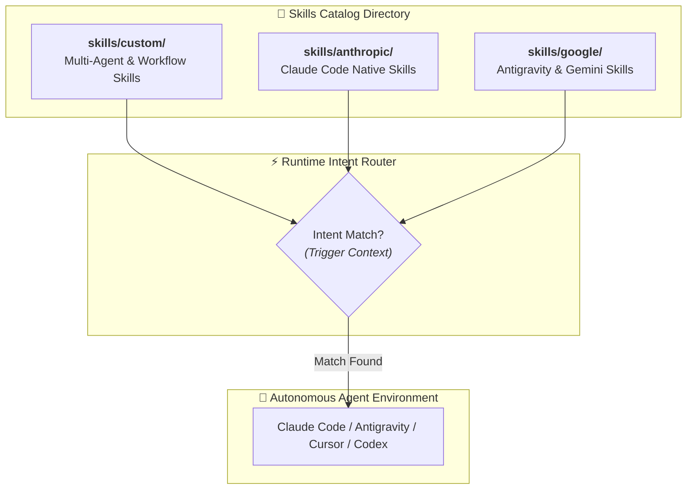

<div align="center">

# 🧩 Production Agent Skills Catalog

### *Standardized, Attested & Evaluated Procedural Knowledge Catalog for AI Coding Agents*

<br/>

[](https://agentskills.io/specification)
[](../README.md#-multi-agent-ecosystem-support)
[](../utils/Skill-Doctor.html)
[](../LICENSE)

<br/>

[**⚡ Quick Install**](#-1-liner-skill-installation) &nbsp;•&nbsp; [**💡 Overview**](#-overview--architecture) &nbsp;•&nbsp; [**🟢 Custom Skills**](./custom/README.md) &nbsp;•&nbsp; [**🟣 Anthropic Skills**](./anthropic/README.md) &nbsp;•&nbsp; [**🔵 Google Skills**](./google/README.md) &nbsp;•&nbsp; [**📖 Specification**](../docs/SPECIFICATIONS.md)

<br/>

</div>

---

<br/>

## 💡 Overview & Architecture

This directory serves as the centralized catalog of production-ready agent skills engineered for autonomous AI development.

<br/>

> [!IMPORTANT]
> **Zero Token Exhaustion via Progressive Disclosure**  
> Rather than dumping heavy system prompts into an LLM context, skills are discovered via lightweight YAML headers (~100 tokens), executing full procedural workflows only upon positive intent match.

<br/>



<br/>

---

<br/>

## 🎯 Catalog Structure & Partitioning

Skills in this library are organized into three clear sub-ecosystems:

<br/>

| Category Directory | Scope & Focus Area | Status | Target Platforms |
|---|---|:---:|---|
| [**`skills/custom/`**](./custom/README.md) | **Cross-Platform & Engineering Workflows**: Multi-agent docs sync, pre-flight release auditing, documentation modernizing, and domain workflows. | `🟢 Active` | Claude Code, Google Antigravity, Cursor, OpenAI Codex |
| [**`skills/anthropic/`**](./anthropic/README.md) | **Claude Code Native Workflows**: Deep subagent delegation, Bash/MCP optimization, and Claude-specific command sets. | `🟡 In Progress` | Anthropic Claude Code CLI & Desktop |
| [**`skills/google/`**](./google/README.md) | **Google Antigravity & Gemini Workflows**: Sidecar integrations, AGY slash commands, and workspace plugin bundles. | `🟡 In Progress` | Google Antigravity 2.0 & Gemini IDE |

<br/>

---

<br/>

## 🟢 Active & Verified Skills Catalog

<br/>

| Skill & Link | Category | Version | Attestation | Description & Trigger Context |
|---|:---:|:---:|:---:|---|
| [**`multi-agent-docs`**](./custom/multi-agent-docs/SKILL.md) | Custom | `v1.1.0` | `🟢 Verified` | Deterministically scaffolds and synchronizes `CLAUDE.md`, `AGENTS.md`, `.claude/`, and `.agents/` across platforms.<br/>**Trigger**: *Use when configuring a repository for multi-agent workflows or fixing instruction drift.* |
| [**`public-repo-release-review`**](./custom/public-repo-release-review/SKILL.md) | Custom | `v1.0.0` | `🟢 Verified` | Pre-flight audit suite for public GitHub releases: secret leak scanning, open-source governance (`SECURITY.md`, `COLLABORATORS.md`, `CITATION.cff`), link integrity, and hygiene.<br/>**Trigger**: *Use when preparing a repository for public release.* |
| [**`readme-designer`**](./custom/readme-designer/SKILL.md) | Custom | `v1.0.0` | `🟢 Verified` | Modernizes and designs high-impact, world-class READMEs with vertical spacing (`<br/>`), section breaks (`---`), comparative tables, and Mermaid flowcharts.<br/>**Trigger**: *Use when designing, formatting, modernizing, or polishing a project README or documentation.* |

<br/>

---

<br/>

## ⚡ 1-Liner Skill Installation

Install any skill directly into your existing project workspace without cloning this repository:

<br/>

```bash
# 🟣 Install to Claude Code (.claude/skills)
npx degit kunalsuri/1000x-Agent-Skills/skills/custom/multi-agent-docs .claude/skills/multi-agent-docs
npx degit kunalsuri/1000x-Agent-Skills/skills/custom/public-repo-release-review .claude/skills/public-repo-release-review
npx degit kunalsuri/1000x-Agent-Skills/skills/custom/readme-designer .claude/skills/readme-designer

# 🔵 Install to Google Antigravity / Cursor / Codex (.agents/skills)
npx degit kunalsuri/1000x-Agent-Skills/skills/custom/multi-agent-docs .agents/skills/multi-agent-docs
npx degit kunalsuri/1000x-Agent-Skills/skills/custom/public-repo-release-review .agents/skills/public-repo-release-review
npx degit kunalsuri/1000x-Agent-Skills/skills/custom/readme-designer .agents/skills/readme-designer
```

<br/>

---

<br/>

## 📐 The 3 Engineering Pillars

Every skill in this catalog satisfies the open specification ([agentskills.io](https://agentskills.io/specification)):

<br/>

```
┌─────────────────────────────────┐      ┌─────────────────────────────────┐      ┌─────────────────────────────────┐
│          1. DECLARED            │      │          2. ATTESTED            │      │          3. EVALUATED           │
│   Strict YAML Frontmatter       │ ───> │   Empirical Proof & Logs        │ ───> │   Intent Precision & Recall     │
│   Schema, Tools & Token Budgets │      │   Multi-Model Resilience Matrix │      │   Automated Test-Case Suite     │
└─────────────────────────────────┘      └─────────────────────────────────┘      └─────────────────────────────────┘
```

<br/>

| Pillar | Specification & Requirement | Verification Standard |
|---|---|---|
| **1. 📋 Declared** | Explicit YAML frontmatter (`name`, `version`, `description`, `allowed-tools`). Body $\le 500$ lines. | Token budget $\approx 100$ tokens at startup. |
| **2. 🛡️ Attested** | Empirical logs in `attestation.json`. | Verified on Claude 3.7 Sonnet, Gemini 3.7 Flash, GPT-4o. |
| **3. 🧪 Evaluated** | Benchmark suites in `evals/test-cases.json`. | Precision $\ge 85\%$ and Recall $\ge 90\%$. |

<br/>

---

<br/>

## 🩺 Diagnostic & Verification Tooling

<br/>

```bash
# 🔍 Run the automated validation suite across all catalog skills
python scripts/validate_skills.py

# 🎨 Audit your project README quality, spacing, badges & link integrity
python skills/custom/readme-designer/scripts/audit_readme.py --target README.md --strict

# 🔒 Run pre-flight release audit for secret leaks & governance files
python skills/custom/public-repo-release-review/scripts/audit_repo.py --target . --strict
```

<br/>

---

<br/>

## 💡 Authoring & Contributing New Skills

Looking to author and contribute a new skill?

1. Read the [**Student & Contributor Guide**](../docs/STUDENT-GUIDE.md).
2. Use the [**Skill Creator Lab Prompt**](../utils/skill-creator/SKILL-CREATOR-PROMPT.md).
3. Test your skill in [**Skill Doctor**](../utils/Skill-Doctor.html) and achieve a **Grade A Health Score ($\ge 85$)**.
4. Open a Pull Request targeting `skills/<category>/<skill-name>/`.

<br/>

---

<br/>

## 📄 License & Governance

All catalog skills are open-source and released under the **Apache 2.0 License** — see [LICENSE](../LICENSE).

<br/>

<div align="center">

[⬅️ Back to Main Repository Readme](../README.md)

</div>
